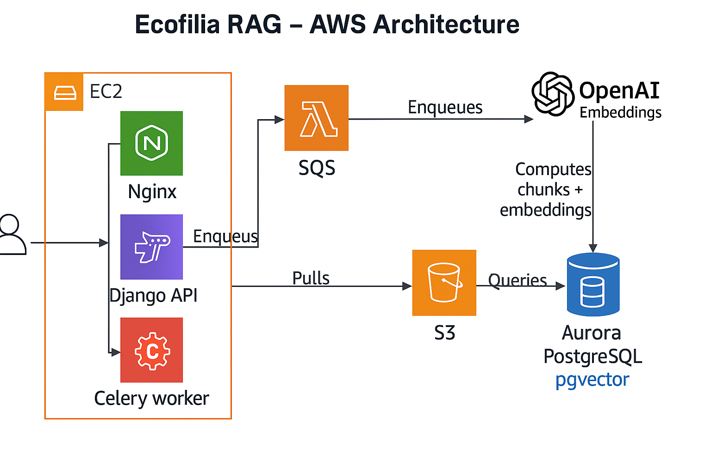

# Ecofilia - Technical Documentation

## Project Overview

Ecofilia es una plataforma Django que combina gestión documental, RAG conversacional y evaluaciones estructuradas. El backend procesa y chunkéa documentos con embeddings de OpenAI, aplica búsqueda vectorial con pgvector y orquesta chat seguro y evaluaciones sobre los documentos permitidos (propios, públicos o compartidos vía documento o proyecto).

### Key Features (implementadas)
- Carga individual o masiva de documentos (PDF, DOC/DOCX, TXT) con extracción y normalización de texto.
- Chunking con tiktoken + embeddings OpenAI y almacenamiento vectorial en pgvector.
- Búsqueda semántica y chat RAG limitado a documentos permitidos (propios/públicos/compartidos/proyectos compartidos).
- Compartición granular de documentos, proyectos y evaluaciones (roles viewer/editor).
- Proyectos como contenedores de documentos; evaluaciones que usan snapshots de documentos.
- Ejecuciones de evaluaciones (LLM) con contexto RAG y persistencia de resultados por pilar/métrica.
- Autenticación JWT con rotación + blacklist, MFA TOTP, rate limiting y invalidación automática en cambios sensibles.
- Tareas asíncronas con Celery (procesamiento de documentos y evaluaciones) y SQS en producción.
- Almacenamiento S3 en producción, filesystem local en desarrollo. Docker-ready.

---

## Technology Stack

### Core Technologies
- **Python 3.12+**, **Django 5.x**, **Django REST Framework**
- **PostgreSQL 16** + **pgvector**
- **Celery 5.x** (SQS en prod, eager/local en DEBUG)
- **OpenAI API** (embeddings + chat completion)
- **AWS S3** (media) / filesystem local

### Development / Ops
- Poetry, Docker & Docker Compose, Gunicorn + Nginx (prod)
- Boto3, django-storages, django-cors-headers, django-filter
- pgvector, psycopg2-binary, tiktoken
- PyMuPDF + PyPDF2 + python-docx (parsers)
- djangorestframework-simplejwt[crypto], django-otp / pyotp (MFA)

---

## Project Structure

```
backend/
├── apps/
│   ├── document/        # Documentos + SmartChunks + shares + RAG API
│   ├── chat/            # ChatSession/Message, RAG helpers y endpoints
│   ├── project/         # Proyectos, shares y agregación de documentos
│   ├── evaluation/      # Evaluaciones, pilares/métricas, runs y shares
│   ├── authentication/  # JWT, MFA, password reset, refresh seguro
│   └── user/            # Custom User (email-first, roles, MFA flags)
├── main/                # Settings, Celery, URLs, ASGI/WSGI
├── docker/              # Dockerfile, entrypoints, template.env
├── docker-compose*.yml  # Dev / local / prod
└── SECURITY_AUDIT.md    # Notas de hardening
```

---

## Architecture & Flows

### System Components
- **Web / API**: Django REST Framework (JWT + optional session/basic), browsable API habilitado en dev.
- **DB**: PostgreSQL + pgvector (vector cosine distance), índices en slug/owner/embedding.
- **Task Queue**: Celery; SQS en prod (`celery` queue); eager/local en DEBUG.
- **Storage**: S3 (prod via django-storages) o filesystem local.
- **OpenAI**: cliente compartido para embeddings y chat completions.

### Data Flows (reales)
- **Carga y procesamiento de documento**
  1. POST `/api/document/create/` o bulk `/api/document/bulk/`.
  2. Signal `handle_document_post_save` marca `pending` y encola `process_document_chunks` (delay en prod, sync en DEBUG).
  3. Worker descarga archivo, preserva extensión, extrae texto (PyMuPDF con recorte de headers/footers y fallback PyPDF2 / python-docx / txt).
  4. Chunking con tiktoken (500 tokens, overlap 50), embeddings OpenAI, bulk insert de `SmartChunk`.
  5. Marca `chunking_done=True`, guarda `extracted_text`, borra `last_error`.
  6. Signal aparte crea `ChatSession` primaria y añade el documento a `allowed_documents`.

- **Búsqueda / RAG**
  - `GET /api/document/rag/` filtra chunks según permisos: staff ve todo; resto solo documentos propios, públicos, compartidos o en proyectos compartidos. Filtros por slug y `public=true/false`.
  - Similaridad: `SmartChunkQuerySet.top_similar` usa `CosineDistance` y embeddings OpenAI; si hay números en la query se priorizan coincidencias numéricas.

- **Chat**
  - `POST /api/chat/messages/` arma mensajes con prompt del sistema, contexto documental (hasta `CHAT_CONTEXT_CHUNKS`, default 4) restringido a `allowed_documents`, y último historial (`CHAT_HISTORY_MESSAGES`, default 10).
  - Genera respuesta OpenAI; guarda `chunk_ids` y `usage` para trazabilidad.

- **Evaluaciones**
  - Evaluaciones tienen pilares/métricas y documentos asociados (o documentos de proyecto o payload).
  - `POST /api/evaluations/<slug>/runs/` crea `EvaluationRun` con snapshot de documentos; encola `run_evaluation_task`.
  - `EvaluationRunner` obtiene chunks relevantes por métrica (respeta permisos del owner del run) y llama OpenAI; persiste resultados por pilar/métrica con fuentes (`chunk_ids`, slug, distancia).

---

## Data Model (resumen)
- `User`: email como username, roles (`admin/manager/member`), flags `email_verified`, `approved`, `mfa_enabled`, `last_password_change`.
- `Document`: owner, `slug` autogenerado, `is_public`, `chunking_status/done/last_error`, `extracted_text`, metadata opcional (categoría/desc), shares y relación con proyectos/evaluaciones.
- `SmartChunk`: `content`, `content_norm` (GeneratedField con `immutable_unaccent(lower)`), `token_count`, `embedding` (1536 dims), `chunk_index`, keywords/summary opcionales.
- `DocumentShare`: user + role (`viewer/editor`), unique per doc+user.
- `Project`: owner, slug, `is_active`, M2M documentos vía `ProjectDocument`, shares `ProjectShare` con roles.
- `Evaluation`: owner, slug, visibility (`private/shared/public`), system_prompt/model/lang/temp, documentos via `EvaluationDocument`, pilares y métricas; shares con roles.
- `EvaluationRun`: snapshot de documentos, modelo/temperatura/idioma, estado (`pending/running/completed/failed`), resultados por pilar/métrica con fuentes y chunk_ids.
- `ChatSession`: owner, primary_document opcional, `allowed_documents` M2M, modelo/temperatura/idioma, constraint de una sesión primaria por (documento, usuario).
- `ChatMessage`: role, content, `chunk_ids` y metadata (usage).

---

## Key Modules & Utilities (código real)
- `apps/document/utils/parser.py`: PyMuPDF con recorte de header/footer, fallback PyPDF2; DOC/DOCX vía python-docx; normaliza saltos y espacios.
- `apps/document/utils/chunker.py`: chunking tiktoken (500 tokens, overlap 50), embeddings con OpenAI; crea `SmartChunk` con token_count.
- `apps/document/utils/client_openia.py`: cliente OpenAI compartido (lazy); `MODEL_EMBEDDING` y `MODEL_COMPLETION` por env.
- `apps/document/services.py`: `accessible_documents_for` aplica permisos (owner, público, share, proyectos compartidos).
- `apps/document/tasks.py`: `process_document_chunks` (max_retries=3, retry_delay=30s) lee archivo a tmp, parsea, chunkéa, bulk_create, marca estado o error.
- `apps/document/signals.py`: en cola chunking on commit (async en prod, sync en DEBUG) y crea `ChatSession` primaria para cada documento nuevo.
- `apps/chat/services/rag.py`: limita chunks a documentos permitidos, respeta permisos de shares/proyectos; arma bloque de contexto con fuente y chunk_index.
- `apps/chat/api/views.py`: crea sesiones/mensajes; construye prompts con sistema + contexto + historial; maneja errores típicos de OpenAI.
- `apps/evaluation/services.py`: `EvaluationRunner` ejecuta run; busca chunks por métrica con RAG, arma prompts con contexto, extrae valor numérico si aplica, guarda resultados con fuentes.
- `apps/evaluation/tasks.py`: wrapper Celery `run_evaluation_task`.
- `apps/authentication/api/views.py`: endpoints register/login/refresh/logout/profile/password reset/MFA; `CustomTokenRefreshView` con throttle estricto y verificación de rotación.
- `apps/authentication/signals.py`: blacklist de JWT en cambio de password o desactivación.

---

## Security & Privacy (implementado)
- **JWT + MFA**: SimpleJWT con `ROTATE_REFRESH_TOKENS=True` y `BLACKLIST_AFTER_ROTATION=True`; throttle dedicado a refresh (`strict_refresh` 20/min por defecto). MFA TOTP opcional; login bloquea si email no verificado o MFA requerido.
- **Invalidación de tokens**: señal `invalidate_tokens_on_sensitive_change` blacklistea refresh/Outstanding tokens al cambiar contraseña o desactivar usuario.
- **Permisos de acceso a datos**: todo RAG/chat/evaluación usa filtros de visibilidad: staff todo; resto solo owner, público, share directo (`DocumentShare/ProjectShare/EvaluationShare`) o documentos de proyectos compartidos. Endpoints tienen permisos DRF + validaciones en serializers de documentos permitidos.
- **CORS/CSRF/cookies**: CORS restringible por env; `CSRF_COOKIE_HTTPONLY=True`, `SESSION_COOKIE_HTTPONLY=True`, `SAMESITE` configurable, `SECURE_SSL_REDIRECT` y flags `*_SECURE` vía env. CSRF en sesiones; JWT endpoints son stateless.
- **Rate limiting**: DRF throttles `anon` y `user` configurables; scope `strict_refresh` más estricto para refresh.
- **Headers/seguridad app**: `X_FRAME_OPTIONS=DENY`, `SECURE_CONTENT_TYPE_NOSNIFF`, `SECURE_REFERRER_POLICY=same-origin`, HSTS configurable.
- **Logging**: manejo de errores de OpenAI y refresh sin exponer tokens; trazabilidad de chunk_ids/sources para respuestas.

---

## API Surface (resumen)
- `POST /api/document/create/`, `POST /api/document/bulk/`, `GET /api/document/list/`, `GET/PUT/PATCH/DELETE /api/document/<slug>/`, shares y chat-session por doc.
- `GET /api/document/rag/` búsqueda semántica con filtros `documents` y `public`.
- `POST /api/chat/sessions/`, `POST /api/chat/messages/` chat RAG con trazabilidad de chunks.
- `POST /api/projects/` CRUD + attach/remove docs + shares + listing de runs.
- `POST /api/evaluations/` CRUD + shares + creación/consulta de runs.
- `POST /api/auth/*` registro, login (MFA), refresh seguro, logout (blacklist), password reset/change, profile.

---

## Environment Variables
Required:
```bash
SECRET_KEY, JWT_SIGNING_KEY, DEBUG, ALLOWED_HOSTS,
POSTGRES_USER, POSTGRES_PASSWORD, POSTGRES_NAME, POSTGRES_HOST, POSTGRES_PORT,
OPENAI_API_KEY, MODEL_EMBEDDING, DEFAULT_FROM_EMAIL, FRONTEND_BASE_URL
```
Prod storage/queue:
```bash
AWS_STORAGE_BUCKET_NAME, AWS_S3_REGION_NAME, SQS_QUEUE_URL, SQS_REGION
```
Optional/tuning:
```bash
MODEL_COMPLETION            # default gpt-4o-mini
CHAT_CONTEXT_CHUNKS         # default 4
CHAT_HISTORY_MESSAGES       # default 10
EVALUATION_CONTEXT_CHUNKS   # default CHAT_CONTEXT_CHUNKS
JWT_ACCESS_TTL_MINUTES      # default 15
JWT_REFRESH_TTL_DAYS        # default 7
DRF_THROTTLE_RATE_ANON      # default 30/min
DRF_THROTTLE_RATE_USER      # default 120/min
DRF_THROTTLE_RATE_REFRESH   # default 20/min (strict_refresh)
MFA_ISSUER_NAME             # label TOTP
SESSION_COOKIE_SECURE, CSRF_COOKIE_SECURE, SESSION_COOKIE_SAMESITE, CSRF_COOKIE_SAMESITE
CORS_ALLOWED_ORIGINS, CSRF_TRUSTED_ORIGINS
```

---

## Development & Operations
- **Setup**: copiar `docker/template.env` a `docker/.env`, ajustar variables. `docker-compose up -d`, luego `docker-compose exec backend python manage.py migrate` y `createsuperuser`.
- **Celery**: levantar worker `celery -A main worker -l info` (o contenedor `celery-worker` en prod/SQS).
- **Tests**: `python manage.py test` (o scoped por app).
- **Rutas**: ver `main/urls.py` (document/chat/projects/evaluations/auth).

### Troubleshooting
- Documentos sin chunks: revisar logs de worker, campo `last_error`, o reintentar `process_document_chunks(doc_id)`.
- Vector search vacío: verificar extensión pgvector instalada y embeddings generados.
- Auth: si cambia password o se desactiva un usuario, refresh tokens previos quedan blacklisted; re-login requerido.

---

## Project Status
- ✅ Ingesta y chunking de documentos (PDF/DOCX/TXT) con embeddings
- ✅ Búsqueda vectorial y chat RAG acotado por permisos
- ✅ Compartición de documentos/proyectos/evaluaciones
- ✅ Proyectos y evaluaciones con runs y resultados almacenados
- ✅ Autenticación JWT + MFA + refresh seguro + blacklist en cambios sensibles
- ✅ Tareas asíncronas con Celery (documentos y evaluaciones)
- ✅ Integración AWS S3/SQS (prod)
- 🚧 Métricas/monitoring avanzados y caching
# Ecofilia - Technical Documentation

## Project Overview

Ecofilia is a Django-based document management and retrieval system with RAG (Retrieval-Augmented Generation) capabilities. It allows users to upload documents, automatically processes and chunks them with OpenAI embeddings, and provides semantic search functionality using PostgreSQL with pgvector extension.

### Key Features
- Document upload and processing
- Automatic text extraction (PDF, DOCX)
- Intelligent text chunking with embeddings
- Semantic search using vector similarity
- Conversational AI chat with RAG context
- JWT authentication with optional MFA (TOTP)
- RESTful API with browsable interface
- Background task processing with Celery
- AWS S3 storage integration
- Docker containerization

---

## Technology Stack

### Core Technologies
- **Python 3.12+**
- **Django 5.2+**
- **PostgreSQL 16** with **pgvector extension**
- **Django REST Framework**
- **Celery 5.5+** for async task processing
- **OpenAI API** for embeddings
- **AWS S3** for file storage
- **AWS SQS** for Celery broker

### Development Tools
- **Poetry** for dependency management
- **Docker & Docker Compose** for containerization
- **Gunicorn** for production WSGI server
- **Nginx** for reverse proxy (production)
- **Boto3** for AWS services
- **Tiktoken** for token counting

### Key Libraries
- `django-cors-headers` - CORS handling
- `django-filter` - Advanced filtering
- `python-docx` - DOCX parsing
- `PyPDF2` - PDF parsing
- `openai` - Embeddings API
- `psycopg2-binary` - PostgreSQL adapter
- `django-storages` - S3 storage backend
- `djangorestframework-simplejwt[crypto]` - JWT issuance & blacklist
- `django-otp` / `pyotp` - TOTP-based MFA

---

## Project Structure

```
backend/
├── apps/
│   ├── document/          # Document management app
│   │   ├── api/           # API endpoints
│   │   │   ├── views.py   # ViewSets and API views
│   │   │   ├── serializers.py  # DRF serializers
│   │   │   ├── urls.py    # URL routing
│   │   │   └── filters.py # Query filtering
│   │   ├── models.py      # Document & SmartChunk models
│   │   ├── tasks.py       # Celery background tasks
│   │   ├── signals.py     # Django signals
│   │   └── utils/         # Utility modules
│   │       ├── chunker.py      # Text chunking logic
│   │       ├── client_openia.py  # OpenAI client
│   │       ├── parser.py       # File parsing
│   │       ├── query_filters.py  # Query filtering
│   │       └── client_tiktoken.py  # Token counting
│   ├── chat/              # Conversational RAG app
│   │   ├── api/           # Session & message endpoints
│   │   ├── services/      # RAG helpers and OpenAI orchestration
│   │   ├── models.py      # ChatSession & ChatMessage models
│   │   └── tests/         # API tests
│   ├── authentication/    # JWT, refresh tokens, MFA
│   │   ├── api/           # Auth endpoints (register/login/profile/mfa)
│   │   ├── services/      # Email, tokens, MFA helpers
│   │   └── signals.py     # Token blacklist invalidation hooks
│   └── user/              # Custom user app
│       └── models.py      # Custom User model
├── main/                   # Django project root
│   ├── settings/          # Environment-specific settings
│   │   ├── base.py       # Shared settings
│   │   ├── dev.py        # Development settings
│   │   └── prod.py       # Production settings
│   ├── celery.py         # Celery configuration
│   ├── urls.py           # Main URL configuration
│   ├── asgi.py           # ASGI config
│   └── wsgi.py           # WSGI config
├── docker/
│   ├── Dockerfile        # Backend container image
│   ├── entrypoint.sh     # Dev entrypoint
│   ├── entrypoint-prod.sh  # Production entrypoint
│   └── template.env      # Environment template
├── docker-compose.yml    # Local development setup
├── docker-compose-local.yml  # Alternative local config
├── docker-compose-prod.yml   # Production config
├── pyproject.toml        # Poetry dependencies
├── manage.py            # Django CLI
└── README.md            # Project README
```

---

## Architecture

### Architecture Diagram



### System Components

#### 1. Web Application Layer
- **Django REST Framework** handles HTTP requests
- **Nginx** serves static files and reverse proxies (production)
- **Gunicorn** runs the Django application (production)

#### 2. Database Layer
- **PostgreSQL** with **pgvector** for vector storage
- Stores documents, chunks, and embeddings
- Vector similarity search using cosine distance

#### 3. Task Queue
- **Celery** workers process documents asynchronously
- **AWS SQS** as message broker
- Background processing for:
  - Document parsing
  - Text extraction
  - Chunking
  - Embedding generation
  - Evaluaciones (tarea `run_evaluation_task`)

#### 4. Storage
- **AWS S3** for file storage (production)
- Local filesystem for development

#### 5. External Services
- **OpenAI API** for generating embeddings

### Data Flow

#### Document Upload & Processing
```
1. User uploads file → POST /api/document/create/
2. Document model saved → Django signal triggered
3. Signal fires Celery task → process_document_chunks.delay(doc_id)
4. Celery worker picks up task from SQS
5. Worker downloads file from S3/local storage
6. Worker extracts text (parser.py)
7. Worker chunks text and generates embeddings (chunker.py)
8. Worker saves SmartChunk objects with embeddings
9. Worker updates Document.status to "done"
```

#### RAG Query Flow
```
1. User sends query → GET /api/document/rag/?query=...
2. API receives query → RAGQueryView
3. Generate query embedding → client_openia.embed_text()
4. Query database → SmartChunk.objects.top_similar(query_text)
5. PostgreSQL computes cosine distance
6. Returns top 5 similar chunks
7. API serializes and returns results
```

---

## Database Schema

### Document Model
```python
class Document(models.Model):
    owner = ForeignKey(User)           # Document owner
    name = CharField(255)              # Display name
    slug = SlugField(unique=True)     # URL-friendly identifier
    category = CharField(255)          # Document category
    description = TextField()          # Description
    file = FileField()                 # Uploaded file
    created_at = DateTimeField()       # Creation timestamp
    extracted_text = TextField()        # Extracted content
    chunking_status = CharField()      # Status: pending/processing/done/error
    chunking_offset = IntegerField()    # Processing offset
    chunking_done = BooleanField()     # Completion flag
    last_error = TextField()           # Error messages
    retry_count = IntegerField()       # Retry attempts
    is_public = BooleanField()         # Visibility flag
```

### SmartChunk Model
```python
class SmartChunk(models.Model):
    document = ForeignKey(Document)           # Parent document
    chunk_index = IntegerField()              # Position in document
    content = TextField()                     # Chunk text
    content_norm = GeneratedField()          # Normalized text (PostgreSQL generated)
    token_count = IntegerField()             # Token count
    title = CharField(255)                   # Chunk title
    summary = TextField()                    # Summary
    keywords = ArrayField(TextField)         # Extracted keywords
    embedding = VectorField(dimensions=1536) # OpenAI embedding vector
    created_at = DateTimeField()            # Creation timestamp
```

### Indexes
- Document: `slug` (unique), `owner`, `chunking_status`
- SmartChunk: `document_id`, `chunk_index`, `embedding` (vector similarity)

---

## Development Setup

### Prerequisites
- Python 3.12+
- Docker & Docker Compose
- Poetry (for dependency management)
- PostgreSQL 16+ with pgvector extension
- OpenAI API key

### Local Development

1. **Clone the repository**
```bash
git clone <repository-url>
cd backend
```

2. **Set up environment**
```bash
# Copy environment template
cp docker/template.env docker/.env

# Edit .env with your configuration
nano docker/.env
```

Required environment variables:
```bash
SECRET_KEY=your-secret-key
DEBUG=True
POSTGRES_USER=postgres
POSTGRES_PASSWORD=postgres1234
POSTGRES_NAME=postgres
POSTGRES_HOST=db
POSTGRES_PORT=5432
OPENAI_API_KEY=sk-your-key
MODEL_EMBEDDING=text-embedding-3-small
```

3. **Install dependencies with Poetry**
```bash
poetry install
poetry shell  # Activate virtual environment
```

4. **Run with Docker Compose**
```bash
# Start all services
docker-compose up -d

# View logs
docker-compose logs -f backend

# Access Django shell
docker-compose exec backend python manage.py shell

# Run migrations
docker-compose exec backend python manage.py migrate

# Create superuser
docker-compose exec backend python manage.py createsuperuser
```

5. **Access the application**
- API: http://localhost/api/document/
- Admin: http://localhost/admin/
- DRF UI: http://localhost/api/document/ (browsable API)

### Without Docker (Poetry)
```bash
# Install dependencies
poetry install

# Set up local PostgreSQL
# Ensure pgvector extension is installed

# Activate environment
poetry shell

# Run migrations
python manage.py migrate

# Create superuser
python manage.py createsuperuser

# Run development server
python manage.py runserver
```

---

## Development Workflow

### 1. Creating a New Feature

#### Add a New App
```bash
cd apps
python ../manage.py startapp myapp
```

Add to `INSTALLED_APPS` in `main/settings/base.py`:
```python
LOCAL_APPS = [
    "main",
    "apps.user",
    "apps.document",
    "apps.myapp",  # Add here
]
```

#### Create API Endpoints
1. Create serializers in `api/serializers.py`
2. Create views in `api/views.py`
3. Add URL routing in `api/urls.py`
4. Include URLs in main `urls.py`

Example:
```python
# apps/document/api/views.py
from rest_framework import generics
from rest_framework.permissions import IsAuthenticated

class MyView(generics.ListCreateAPIView):
    permission_classes = [IsAuthenticated]
    queryset = MyModel.objects.all()
    serializer_class = MySerializer
```

#### Create Model Migrations
```bash
python manage.py makemigrations
python manage.py migrate
```

### 2. Running Tests
```bash
# Run all tests
python manage.py test

# Run specific app tests
python manage.py test apps.document

# Run with coverage
coverage run --source='.' manage.py test
coverage report
```

### 3. Code Quality

#### Linting
```bash
# Install pre-commit hooks (if configured)
pre-commit install

# Run linters manually
flake8 apps/
black apps/
isort apps/
```

#### Type Checking
```bash
mypy .
```

### 4. Database Operations

#### Create Migration
```bash
python manage.py makemigrations
```

#### Apply Migrations
```bash
python manage.py migrate
```

#### Rollback Migration
```bash
python manage.py migrate app_name previous_migration_name
```

#### SQL Shell
```bash
python manage.py dbshell
```

### 5. Debugging

#### Django Shell
```bash
# Regular shell
python manage.py shell

# IPython shell (better)
python manage.py shell_plus

# Debug with print statements or IPython debugger
from IPython import embed; embed()
```

#### Logging
Check logs in Docker containers:
```bash
docker-compose logs -f backend
```

Django logging configured in settings:
```python
LOGGING = {
    'version': 1,
    'handlers': {
        'console': {
            'class': 'logging.StreamHandler',
        }
    },
    'loggers': {
        'apps.document': {
            'handlers': ['console'],
            'level': 'DEBUG',
        }
    }
}
```

---

## Production Deployment

### Environment Configuration

Use `docker-compose-prod.yml` and configure:

```bash
# Production settings
DEBUG=False
SECRET_KEY=<strong-random-secret>
POSTGRES_HOST=production-db-host
AWS_STORAGE_BUCKET_NAME=your-s3-bucket
AWS_S3_REGION_NAME=us-east-1
SQS_QUEUE_URL=https://sqs.region.amazonaws.com/account/queue-name
OPENAI_API_KEY=sk-production-key
```

### AWS Resources Required

1. **S3 Bucket** for file storage
   - Set CORS policy for browser uploads
   - Configure IAM access

2. **SQS Queue** for Celery
   - Standard queue recommended
   - Configure visibility timeout (max task duration)
   - Dead letter queue for failed tasks

3. **PostgreSQL Database**
   - Enable pgvector extension
   - Configure backups
   - Set up read replicas if needed

### Deployment Steps

1. **Build production image**
```bash
docker build -f docker/Dockerfile -t ecofilia-backend:latest .
```

2. **Deploy with docker-compose**
```bash
docker-compose -f docker-compose-prod.yml up -d
```

3. **Run migrations**
```bash
docker-compose exec backend python manage.py migrate
```

4. **Collect static files**
```bash
docker-compose exec backend python manage.py collectstatic --noinput
```

5. **Setup Celery worker**
```bash
# Run Celery worker in separate container
celery -A main worker -l info --concurrency=4
```

### Monitoring

- Check application logs: `docker-compose logs -f backend`
- Monitor Celery tasks: Use Flower or CloudWatch
- Database monitoring: pgAdmin or CloudWatch RDS metrics
- API metrics: Add logging middleware or APM tools

---

## Key Modules & Utilities

### Document Processing (`apps/document/utils/`)

#### `parser.py`
- Extracts text from PDF and DOCX files
- Handles encoding issues
- Returns plain text for chunking

#### `chunker.py`
- Splits text into semantic chunks
- Generates OpenAI embeddings
- Creates SmartChunk objects with metadata
- Handles token limits

#### `client_openia.py`
- OpenAI API client wrapper
- Generates embeddings using `text-embedding-3-small`
- Error handling and retry logic

#### `client_tiktoken.py`
- Token counting for OpenAI models
- Ensures chunks stay within token limits
- Uses GPT-4 tokenizer by default

#### `query_filters.py`
- Advanced query filtering for RAG search
- Number extraction from queries
- Content normalization

### Background Tasks (`apps/document/tasks.py`)

#### `process_document_chunks()`
- Async Celery task for document processing
- Downloads file from S3/local storage
- Extracts, chunks, embeds text
- Handles errors and retries
- Updates Document status

**Task Configuration:**
- `max_retries=3`
- `default_retry_delay=30` seconds
- Uses `bind=True` for retry logic

### Signals (`apps/document/signals.py`)

#### `handle_document_post_save()`
- Triggers on Document creation
- Starts background processing
- In DEBUG mode: synchronous processing
- In production: async via Celery

---

### Authentication Module (`apps/authentication/`)

- **`api/views.py`** exposes `/api/auth/*` endpoints (register, login, refresh, logout, profile, password reset, MFA flows). All responses are tailored for the Next.js frontend (JSON only, no HTML redirects).
- **`api/serializers.py`** extends `TokenObtainPairSerializer` to enforce email verification + MFA challenges and provides serializers for password resets, logout, and MFA.
- **`services/tokens.py`** wraps Django's `PasswordResetTokenGenerator` to issue/validate UID + token pairs shared via email links.
- **`services/email.py`** centralizes transactional messages (verification, password reset) and builds URLs using `FRONTEND_BASE_URL`.
- **`services/mfa.py`** manages TOTP secrets/provisioning URIs using `pyotp`.
- **`signals.py`** listens to `pre_save` on `User` and blacklists every outstanding JWT whenever passwords change or accounts are deactivated, ensuring stale tokens are unusable.

SimpleJWT is configured in `main/settings/base.py` with short-lived access tokens (15 minutes), refresh rotation + blacklist, secure cookies, and DRF throttling (`30/min` anonymous, `120/min` authenticated by default). Environment variables (`JWT_SIGNING_KEY`, `JWT_ACCESS_TTL_MINUTES`, `JWT_REFRESH_TTL_DAYS`, `FRONTEND_BASE_URL`, `MFA_ISSUER_NAME`, etc.) control runtime behavior without code changes.

---

## API Endpoints

See `API_DOCUMENTATION.md` for complete API reference.

### Key Endpoints
- `GET /api/document/rag/` - Semantic search
- `POST /api/document/create/` - Upload document
- `GET /api/document/list/` - List documents
- `POST /api/chat/sessions/` - Create chat session scoped to selected documents
- `POST /api/chat/messages/` - Send a message and receive RAG-powered responses

### Chat Module (`apps/chat/`)

- `ChatSession` / `ChatMessage` models guard chat ownership and document scope.
- `services/rag.py` limits retrieval to the session's approved documents and formats context.
- `api/views.py` exposes `/api/chat/sessions/` and `/api/chat/messages/`, orchestrating RAG + OpenAI Responses.
- Security: users can only reference their own or public documents; staff can access all sessions.

---

## Environment Variables

### Required Variables
```bash
SECRET_KEY           # Django secret key
DEBUG               # Boolean (True/False)
ALLOWED_HOSTS       # Comma separated hostnames (* for dev)
CORS_ALLOWED_ORIGINS  # Frontend origins allowed to call the API
CSRF_TRUSTED_ORIGINS  # Origins allowed to send CSRF tokens
POSTGRES_USER       # Database user
POSTGRES_PASSWORD   # Database password
POSTGRES_NAME       # Database name
POSTGRES_HOST       # Database host
POSTGRES_PORT       # Database port
OPENAI_API_KEY      # OpenAI API key
MODEL_EMBEDDING     # Embedding model name
JWT_SIGNING_KEY     # Secret used to sign JWTs (rotate independently)
FRONTEND_BASE_URL   # Used to craft email links (Next.js site)
DEFAULT_FROM_EMAIL  # Sender used for transactional emails
```

### Production Variables
```bash
AWS_STORAGE_BUCKET_NAME  # S3 bucket name
AWS_S3_REGION_NAME       # AWS region
SQS_QUEUE_URL           # Celery queue URL
```

### Optional Variables
```bash
DJANGO_SETTINGS_MODULE  # Settings module (auto-set)
CELERY_BROKER_URL       # Override broker URL
MODEL_COMPLETION        # Chat completion model (default gpt-4o-mini)
CHAT_CONTEXT_CHUNKS     # Max chunks sent per chat turn (default 4)
CHAT_HISTORY_MESSAGES   # Number of historic messages to send to OpenAI (default 10)
JWT_ACCESS_TTL_MINUTES  # Minutes for access tokens (default 15)
JWT_REFRESH_TTL_DAYS    # Days for refresh tokens (default 7)
JWT_ALGORITHM           # JWT signing algorithm (default HS256)
MFA_ISSUER_NAME         # Label displayed in authenticator apps
DRF_THROTTLE_RATE_ANON  # Anonymous rate limit (default 30/min)
DRF_THROTTLE_RATE_USER  # Authenticated rate limit (default 120/min)
SESSION_COOKIE_SECURE   # Force secure cookie in HTTPS (True/False)
CSRF_COOKIE_SECURE      # Force secure cookie in HTTPS (True/False)
SESSION_COOKIE_SAMESITE # Lax/Strict/None
CSRF_COOKIE_SAMESITE    # Lax/Strict/None
```

---

## Common Tasks & Troubleshooting

### Troubleshooting

#### Documents not processing
```bash
# Check Celery worker status
docker-compose logs celery-worker

# Check for errors in document status
python manage.py shell
>>> from apps.document.models import Document
>>> doc = Document.objects.get(slug='your-doc')
>>> print(doc.last_error)  # Check for errors
```

#### Vector search not working
```bash
# Verify pgvector extension
python manage.py dbshell
CREATE EXTENSION IF NOT EXISTS vector;

# Recreate embeddings
python manage.py shell
>>> from apps.document.tasks import process_document_chunks
>>> process_document_chunks(doc_id)
```

#### Authentication issues
```bash
# Create new superuser
python manage.py createsuperuser

# Change password
python manage.py changepassword username
```

### Database Maintenance

#### Backup Database
```bash
docker-compose exec db pg_dump -U postgres postgres > backup.sql
```

#### Restore Database
```bash
docker-compose exec -T db psql -U postgres postgres < backup.sql
```

#### Clear all data (dev only!)
```bash
docker-compose down -v  # Removes volumes
docker-compose up -d    # Recreates everything
```

### Celery Management

#### Purge queue
```bash
celery -A main purge
```

#### Check active tasks
```bash
celery -A main inspect active
```

#### Restart workers
```bash
docker-compose restart celery-worker
```

---

## Security Considerations

### Production Checklist
- [ ] Set `DEBUG=False`
- [ ] Use strong `SECRET_KEY`
- [ ] Configure `ALLOWED_HOSTS`
- [ ] Set up HTTPS/TLS
- [ ] Use secure cookie settings
- [ ] Configure CORS properly
- [ ] Enable database backups
- [ ] Use IAM roles (not keys) for AWS
- [ ] Rotate API keys regularly
- [ ] Enable database encryption at rest
- [ ] Set up rate limiting
- [ ] Monitor for security issues

### API Security
- All protected endpoints expect `Authorization: Bearer <access>` header
- Refresh tokens rotate and are blacklisted on logout/password change/deactivation
- Optional MFA (TOTP) enforces an extra factor on `/api/auth/login/`
- Rate limiting enforced via DRF throttles (configurable)
- Staff users retain elevated scopes; regular users are isolated to their own data

---

## Performance Optimization

### Database
- Indexed fields: `slug`, `owner`, `chunking_status`
- Vector similarity uses pgvector index
- Consider read replicas for heavy queries

### Caching (Future)
- Cache frequently accessed documents
- Redis for session storage
- Query result caching

### Celery
- Adjust worker concurrency based on load
- Configure prefetch limits
- Set appropriate visibility timeout
- Use result backend for long-running tasks

### File Storage
- Use S3 transfer acceleration
- Enable CloudFront CDN
- Compress large files before upload

---

## Contributing

### Code Style
- Follow PEP 8
- Use Black for formatting
- Type hints for new code
- Docstrings for all functions/classes

### Git Workflow
```bash
# Create feature branch
git checkout -b feature/my-feature

# Commit changes
git add .
git commit -m "Add: description"

# Push and create PR
git push origin feature/my-feature
```

### Pull Request Process
1. Create feature branch from `main`
2. Write tests for new features
3. Ensure all tests pass
4. Update documentation
5. Create pull request
6. Code review required
7. Merge after approval

---

## Additional Resources

### Documentation
- [API Documentation](./API_DOCUMENTATION.md)
- [Django Documentation](https://docs.djangoproject.com/)
- [DRF Documentation](https://www.django-rest-framework.org/)
- [Celery Documentation](https://docs.celeryproject.org/)

### External Services
- [PostgreSQL pgvector](https://github.com/pgvector/pgvector)
- [OpenAI Embeddings](https://platform.openai.com/docs/guides/embeddings)
- [AWS S3](https://docs.aws.amazon.com/s3/)
- [AWS SQS](https://docs.aws.amazon.com/sqs/)

### Development Tools
- [Poetry](https://python-poetry.org/)
- [Docker Compose](https://docs.docker.com/compose/)
- [Django Debug Toolbar](https://django-debug-toolbar.readthedocs.io/)

---

## Getting Help

- Check logs: `docker-compose logs -f`
- Django shell: `python manage.py shell`
- Document models: See `apps/document/models.py`
- API issues: Check `API_DOCUMENTATION.md`
- Database issues: Check pgvector installation

## Project Status

- ✅ Document upload and storage
- ✅ Text extraction (PDF, DOCX)
- ✅ Intelligent chunking
- ✅ OpenAI embeddings
- ✅ Vector similarity search
- ✅ RESTful API
- ✅ Background processing
- ✅ AWS integration
- ✅ Authentication improvements (JWT + MFA)
- 🚧 Advanced search features
- 🚧 Analytics and monitoring
